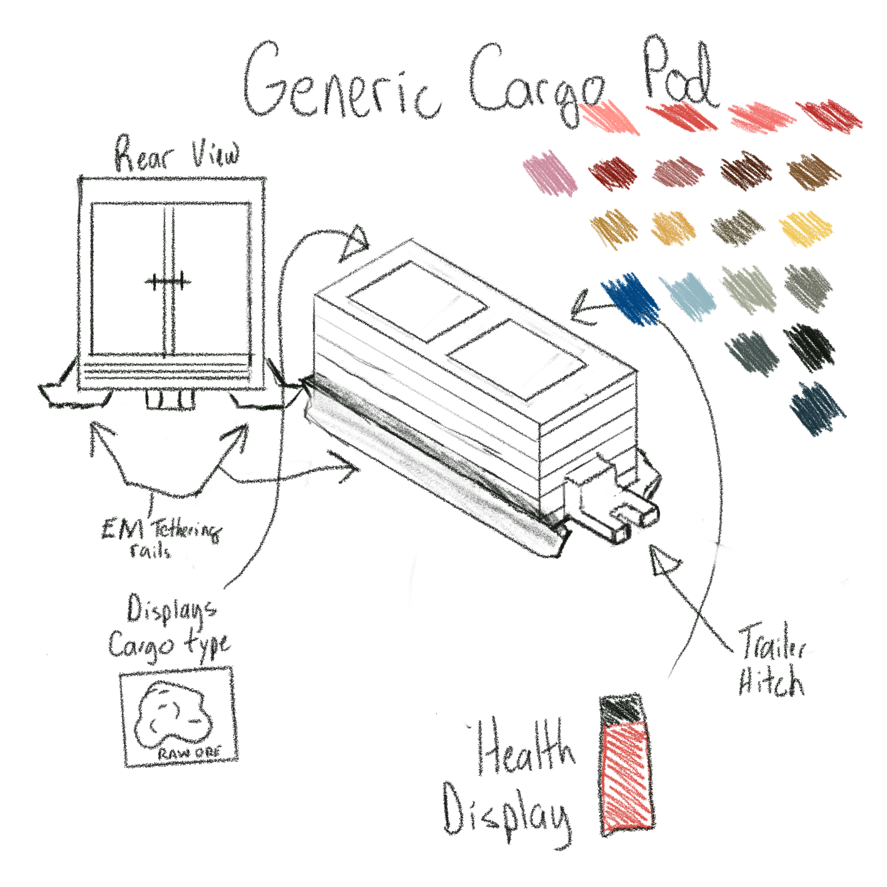
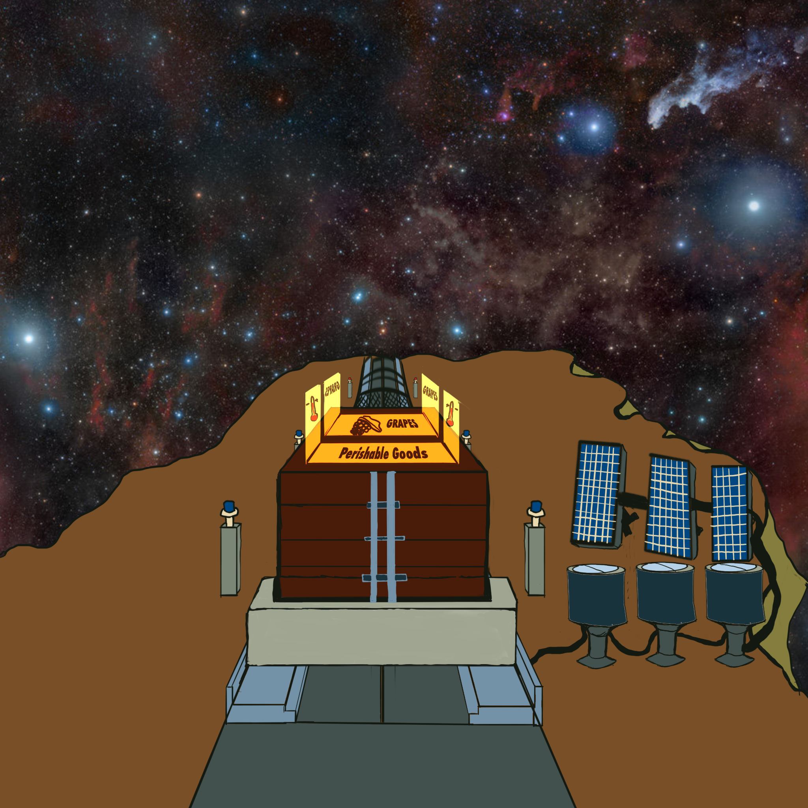

# Space Trucker game mechanics

Thematic inspirations: Futurama, Borderlands

## Basic design overview

In _Space Trucker_, players are in charge of a cargo shipping installation out among the asteroids. Miners send out raw materials to orbital factories, which in turn send finished goods out to the miners. Cargo is catapulted by mass drivers - known as **G**ravitational.**O**utboard.**O**scillating.**S**ling.**E**ngine to operators - to give outgoing pods the initial kick needed to get things moving in the right direction. At the other end of the route, the same units perform the reverse of a launch to catch incoming freight in an intricate ballet of megatonnage, all in constant dynamic motion around the Sun. It's the Great Circle of life, some might say. Others say that's nonsense because things move in more than just 2-D directions so it's the Sphere of Life, but it really doesn't matter because there are schedules to make and deadlines to keep! That asteroid ore isn't going to move itself. and the stars wait for no one, after all...

## Gameplay

Gameplay is divided into different three phases. In the first phase, players "construct" their space-route. This route, twisted by solar storms, littered with space debris, haunted by space-beasts is the challenge players face before reaching the end and the final phase. For the last phase, players are shown the results of their run, with good enough showings being potentially eligible for entry into the high-score board!

### Phase one: trip planning and confirmation

A suitably-zoomed view of the planetary system displays the player's current position along with other planetary bodies, including the destination zone.

Detailed Specs [here](phase-one-spec.md).

### Phase two: Hitting the space-road

Our perspective shifts to the mass driver installation, where players enjoy a brief cutscene that ends with the player in the cabin of their rig, which is in the process of being launched (or "goosed" as operators call it) towards its' destination. 

#### Maneuvering

Players drive their space-rig along the previously defined space-route. To keep the player aware of where they are versus where they need to be, UI elements combine with space-highway road signs to provide contextually relevant information about the route.

This can be important, because there are numerous hazards along the way. Some hazards are passive, like space-junk or space-rocks. Others are more aggressive in nature and will make attempts to hamper, impede, steal, or even destroy cargo!

Possible threats:

* Space-junk
* Space-rocks / comet debris
* Space-hulks
* Solar storms
* Space-beasts

#### Time

Riding empty space does funny things to a person's sense of time. When a driver is "in the pipe, 5x5" it's almost as if time and space bend and twist; things speeds up for the driver. It's also a Well Known-Established Fact that the same sense of time is directly proportional to both how full their bladder is along with the emptiness of the stomach. A full bladder and an empty stomach are a bad combination! If the space-trucker's bladder ever reaches full capacity and the player has no emergency "relief bottles", they'll have to pull over and do the needful wherever possible. Hopefully that will be at a Truck Stop, because if it's not the player fails the scenario. A lack of food makes a person drowsy and less attentive - it can only take a moment's inattention to drift off-course and end up Lost in Space.

#### Hunger and Bladder Control

Players have two resources during this phase, represented by two values

* Stomach Meter - drains over time and due to player or hostile action. As it empties, players gradually experience more and more random control movements -- drifting -- that makes it difficult to control the vehicle
* Bladder Bar - fills over time. May be affected by external factors, but is mostly an hourglass-type of measure. If it ever reaches full capacity the game is over.

#### Completing the mission

When/if the space-truck approaches a potential destination, the local space-traffic control takes over terminal guidance, ending the game phase.

### Phase three: Results and scoring

This is the final game phase, and is where players view the results of their haul and count their earnings (or losses!). The freight contract specifies base compensation amounts, but the actual amounts awarded may vary by some factors:

* Timeliness - some contracts may pay early delivery bonus, others stiff late fees
* Condition of cargo - hopefully, everything arrives in one piece. If not, damages are taken out of the player's earnings
* Completion of delivery - at least one cargo pod arrived at its' destination. Ideally all of them will be credited with this factor.
* Other TBD
