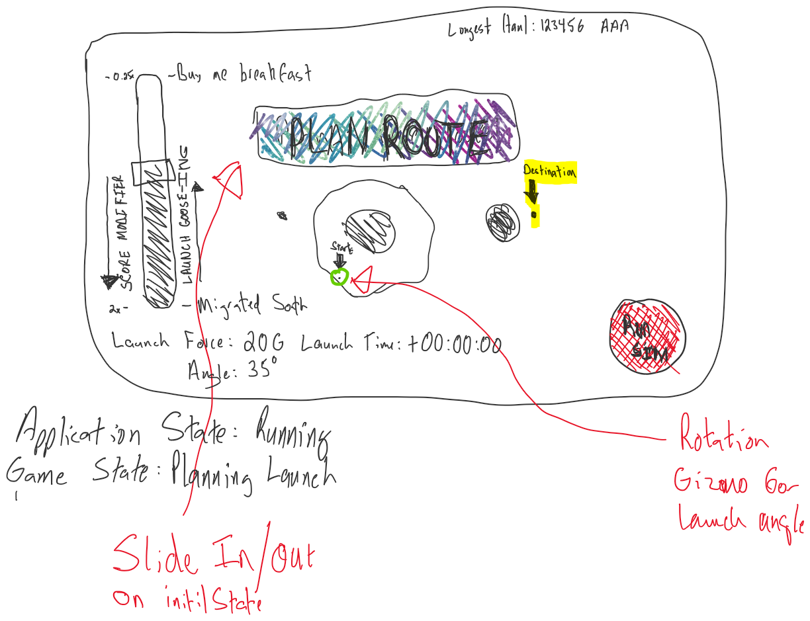
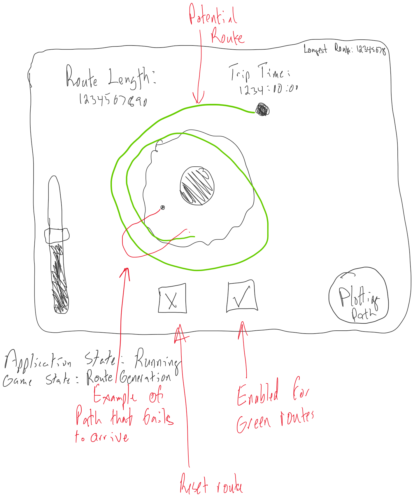

# Route Planning and Simulation

## Player choices

* G.O.O.S.E charge level
  * A key part of trip planning is the choice of launch speeds. In exchange for a lower score multiplier, players may choose to impart more velocity at launch, leading to potentially lower trip times
  * A lower launch velocity brings a higher score multipler, because it will be more sensitive to the other factors of time and launch angle.
* Launch Time
  * The specific moment of launch has a large impact on the resulting route, as the position of the various bodies in orbit will constantly be changing
  * Players can launch at a time of their choosing with no penalties

## Simulating the route

Activating the Run Sim button begins the route planning orbital simulation. The simulation ends when any of the following occurs:

* The player's cargo pod passes into the destination zone
* The cargo pod crashes into the Sun or one of the other planetary bodies
* The cargo pod is ejected from the system and leaves the world boundaries

In the second two items, the simulation is reset to allow the player to try again. In event the first, the player is asked to confirm the simulated route and begin the next phase.

## Generating the track

Starting with the planned route, the game generates a procedural space-route (a tube or cylinder) that lays down segments of track, with potential modifiers.

### Hazards

#### Solar storms

Solar weather that intersects the track will tend to distort and twist affected track segments.

#### Asteroid belts

Segments of the route that pass through the asteroid belt will tend to have significant amounts of rocky debris littering the track, requiring operators to stay alert or risk collisions.

#### Space-Junk

The detrius of space is everywhere. Experienced Space-truckers know that junk can crop up anywhere along a route and pay attention accordingly. 

### Hostiles

#### Space-Amoeba (Beast)

These hungry monsters will try to attach themselves to the cargo trailer, damaging the cargo while slowing the rig down.

### Helpers

#### Space-Porta-Potty

Intended for haulers on-the-go, they will activate when approached, pacing the rig and allowing the operator to relieve theirselves without having to stop.

#### Space-Diner To-Go

When the stomach's rumbling, there's no better way to put the sat in satisfaction than to grab a quick space-bite on the go. Like the space-porta-potties, the Space-Diner gives the hungry hauler a way to grab a bite on the move.
