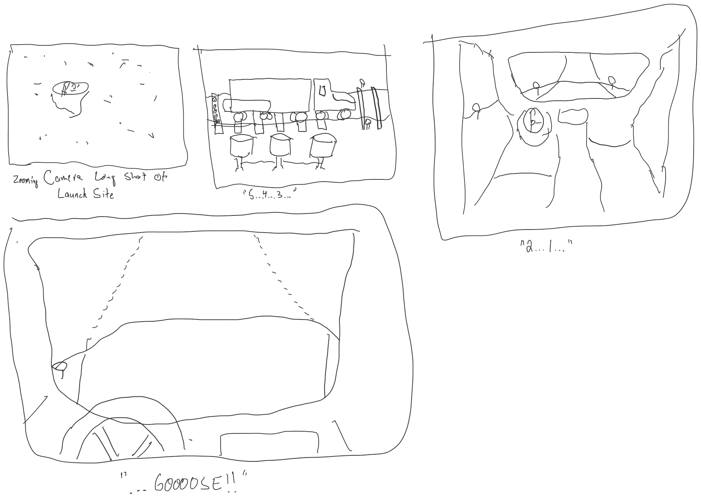
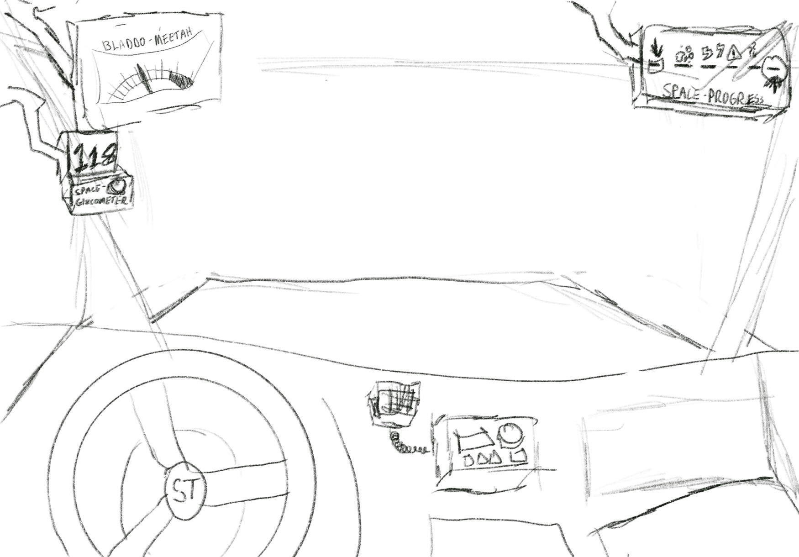
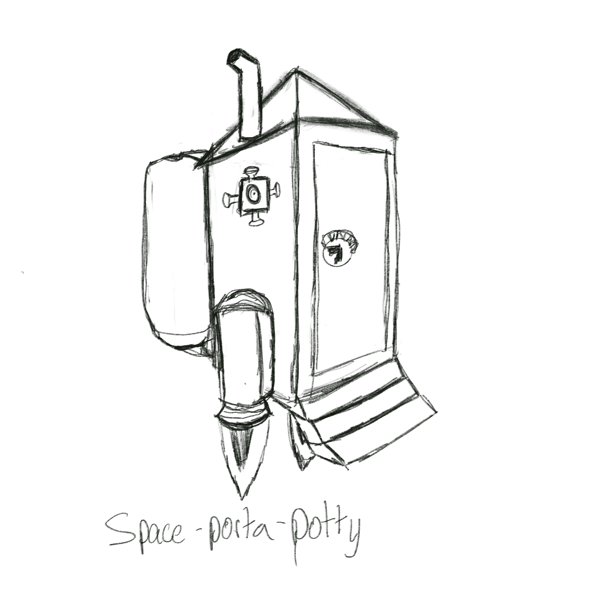

# Phase 2: Route Navigation

Our perspective shifts to the mass driver installation, where players enjoy a brief cutscene that ends with the player in the cabin of their rig, which is in the process of being launched (or "goosed" as operators call it) towards its' destination.

## Gameplay Elements

### Maneuvering

Players drive their space-rig along the previously defined space-route as it twists and turns towards its destination. To keep the player aware of where they are versus where they need to be, UI elements combine with space-highway road signs to provide contextually relevant information about the route.

### Hazards

Some hazards are passive, like space-junk or space-rocks. Others are more aggressive in nature and will make attempts to hamper, impede, steal, or even destroy cargo!

Possible threats:

* Space-junk
* Space-rocks / comet debris
* Space-hulks
* Solar storms
* Space-beasts

### Hunger and Bladder Control

Players have two resources during this phase, represented by two values

* Stomach Meter - drains over time and due to player or hostile action. As it empties, players gradually experience more and more random control movements -- drifting -- that makes it difficult to control the vehicle
* Bladder Bar - fills over time. May be affected by external factors, but is mostly an hourglass-type of measure. If it ever reaches full capacity the game is over.

### Pickups and Specials

WIP

### Completing the mission

When/if the space-truck approaches a potential destination, the local space-traffic control takes over terminal guidance, ending the game phase.
